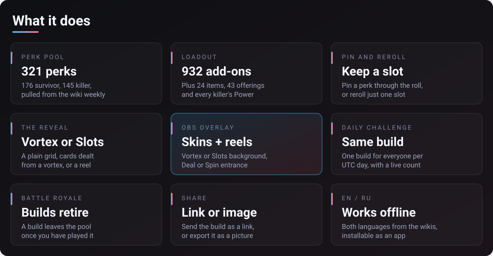
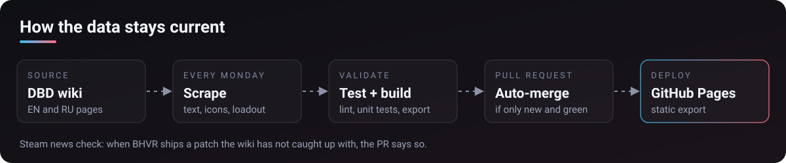

A random build generator for **Dead by Daylight**. Perks, items, add-ons and
offerings come from the official wiki every week, so a new chapter shows up on
the site without anyone editing a list.

<p>
  <a href="https://github.com/flexeykinDev/dbd-perk-randomizer/actions/workflows/ci.yml"></a>
  <a href="https://github.com/flexeykinDev/dbd-perk-randomizer/actions/workflows/update-perks.yml"></a>
  <a href="LICENSE"></a>
</p>

**English · [Русский](README.ru.md)**

## Open it

### [flexeykindev.github.io/dbd-perk-randomizer](https://flexeykindev.github.io/dbd-perk-randomizer/)

Nothing to download. It runs in the browser on desktop and phone.

To keep it as an app that also works offline:

1. Open the site in Chrome, Edge or Safari.
2. On desktop, click the install icon in the address bar. On a phone, open the
   share or browser menu and pick **Add to Home Screen**.
3. Launch it from the Start menu or your home screen.

**Remove:** uninstall it like any other app, or remove the home screen icon.

<!-- prettier-ignore -->
| | |
|---|---|
|  |  |
|  |  |

## What it does



Also: pick a character to guarantee their teachables or decide whose Power
gets rolled, 4 preset builds per role, roll statistics and history, and a pool
manager with search, tags, favourites and multi-killer add-on filters.

### Recently added

- OBS overlay skins: Vortex or Slots background, Ritual or Slots card frame,
  animated or still.
- Deal and Spin entrances. The Slots frame is a real reel that settles left to
  right.
- Patch 10.1.1 values for Repressed Alliance and Vigil, ahead of the wiki.
- The build and the Generate button sit above the fold on a laptop, and every
  dialog fits a phone screen.

### Keyboard

| Key             | Action            |
| --------------- | ----------------- |
| `Space`/`Enter` | Roll a new build  |
| `1`–`4`         | Reroll that slot  |
| `C`             | Copy the build    |
| `S`             | Copy a share link |

Shortcuts stay quiet while you type or a dialog is open, and never take over a
browser shortcut.

## OBS overlay

1. On the site, click **OBS Overlay** and copy the link.
2. In OBS, add a **Browser Source** and paste it.
3. Roll on the site. The overlay on stream updates by itself.

Everything is set in the dialog, and saved in the link:

| Setting    | Options                                         | In the link |
| ---------- | ----------------------------------------------- | ----------- |
| Background | transparent, dark, vortex, slots                | `bg=`       |
| Card frame | plain, ritual, slots                            | `frame=`    |
| Motion     | live, still                                     | `fx=`       |
| Entrance   | rise, drop, flip, glide, deal, spin, none       | `anim=`     |

An old link with none of these keeps looking exactly as it did.

## Privacy and network

- No accounts, no analytics.
- **Firebase** is used for two things only: the OBS overlay, which publishes
  your build under a random room code, and the Daily Challenge counter, which
  is one anonymous number per day. If you never use either, nothing is sent.
- The trailer below the board is a YouTube embed.

<details>
<summary><b>For developers</b></summary>

### Run it

```bash
npm install
npm run dev        # localhost:3000
npm run lint
npm run build      # static export into out/
npm test           # 206 unit tests
npm run test:e2e   # builds first, then 205 Playwright tests against the export
```

`test:e2e` drives the static export on port 3100, not `next dev`, because the
export is what deploys. If the build fails the tests would run against a stale
`out/`, so the server refuses an export older than the sources
(`E2E_ALLOW_STALE=1` to override).

The suite is split by what differs: desktop covers behaviour,
`e2e/mobile.spec.ts` covers overflow, tap targets and modal height, and
`e2e/viewports.spec.ts` measures layout from a 360px phone to a 4K TV.

### Where the data comes from



`data/perks.json` and the loadout files are generated:

```bash
npm run scrape:perks
npm run scrape:loadout
```

Both read the wiki through the MediaWiki API and download icons into
`public/`. Icons are cached by source URL, so a redesigned icon is picked up
on the next run.

`.github/workflows/update-perks.yml` runs every Monday: English scrape, Russian
names and descriptions, lint, unit tests and build, then a PR. It merges on its
own only when the diff adds entries and changes nothing that existed, and the
checks pass. A scrape that returns far fewer perks than last time fails, so a
wiki outage can't empty the pool.

The wiki can lag behind a patch. `scripts/check-patch-notes.ts` reads the
Steam news API and flags any BHVR patch newer than the last scrape in the PR.
Corrections go in `data/overrides/perks.json`, which the next scrape bakes in
and which stops mattering once the wiki agrees.

### OBS sync

OBS renders a browser source in its own Chromium profile, with no
`localStorage` or `BroadcastChannel` shared with your browser. So the main tab
also publishes the build to Firebase under a random 8-character room code, and
the overlay reads it back (`lib/obs-sync.ts`). If Firebase is unreachable, a
second tab in the same browser still works.

For your own deploy, create a Realtime Database, paste your `firebaseConfig`
into `lib/firebase.ts`, and publish these rules (the ones the live site runs).
A room is reachable only by its code, codes can't be listed, and the daily
counter only goes up by one:

```json
{
  "rules": {
    ".read": false,
    ".write": false,
    "obs-rooms": {
      "$room": {
        ".read": "$room.matches(/^[A-HJ-NP-Z2-9]{8}$/)",
        ".write": "$room.matches(/^[A-HJ-NP-Z2-9]{8}$/)",
        ".validate": "newData.hasChildren(['role', 'language', 'updatedAt'])"
      }
    },
    "daily-challenge": {
      "$day": {
        "count": {
          ".read": true,
          ".write": "$day.matches(/^[0-9]{4}-[0-9]{2}-[0-9]{2}$/)",
          ".validate": "newData.isNumber() && newData.val() == (data.exists() ? data.val() : 0) + 1"
        }
      }
    }
  }
}
```

Don't leave the database in Firebase's test mode: anyone can read and write
it, and it locks itself after 30 days. The web config is not a secret; the
rules are what restrict access.

The weekly room cleanup (`scripts/prune-obs-rooms.ts`) needs to list rooms, so
it only runs with a `FIREBASE_DB_SECRET` repository secret and skips otherwise.

### Contributing

[CONTRIBUTING.md](CONTRIBUTING.md) has the detail. In short: run
`npm run lint`, `npm run build` and `npm run test:e2e` first, because CI runs
the same three.

- **Generated files.** Everything the scrapers write (`data/perks.json`,
  `data/items.json`, `data/addons.json`, `data/offerings.json`, the `*-ids`
  and `*-icon-sources` files, `data/author.json`) is overwritten on the next
  run. Edit `data/translations.ru.json`, `data/character-translations.ru.json`,
  `data/overrides/perks.json` and `data/overrides/loadout.json` instead.
- **Screenshots.** After a UI change, `npm run capture:screenshots` rebuilds
  `docs/screenshots/` (needs the dev server on port 3000).

### Deployment

A static export, published to GitHub Pages by `.github/workflows/deploy.yml`
on every push to `main`.

### Stack

Next.js, TypeScript, React, Tailwind CSS, Framer Motion, WebGL, Firebase
Realtime Database, cheerio and sharp for the scrapers, Playwright.

</details>

## Taking part

Issues and pull requests are welcome, in English or Russian. See
[CONTRIBUTING.md](CONTRIBUTING.md), the [code of conduct](CODE_OF_CONDUCT.md)
and the [security policy](SECURITY.md).

## License

[MIT](LICENSE) for the code. Perk names, descriptions, icons and portraits are
Dead by Daylight data, © Behaviour Interactive. This is a fan tool and is not
affiliated with them.
