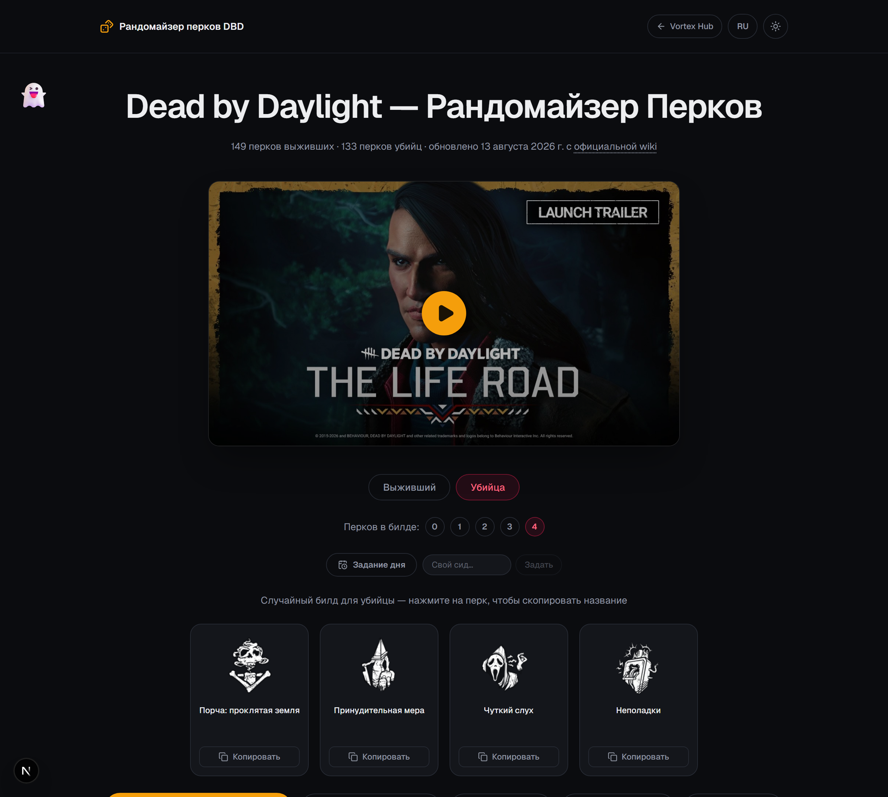

# DBD Perk Randomizer

Рандомайзер перков Dead by Daylight. TypeScript + React + Next.js (App
Router) + Tailwind CSS. Раньше жил как раздел [Vortex
Hub](https://github.com/flexeykinDev/Vortex-Hub), теперь отдельный проект.

**Живой сайт:** https://flexeykindev.github.io/dbd-perk-randomizer/

## Скриншоты

<!-- prettier-ignore -->
| | |
|---|---|
|  |  |
|  |  |
|  |  |

## Что это

Генератор случайного билда из 0–4 перков выжившего/убийцы, с переключением
языка EN/RU, копированием названия перка в буфер обмена по клику,
исключением перков из пула (поиск, теги, сортировка, массовые действия),
шэрингом билда по ссылке, детерминированным Daily Challenge / своим сидом,
локальной статистикой роллов, экспортом билда картинкой и оверлеем для
трансляций (см. ниже). Если исключить перков больше, чем нужно для билда,
сайт честно скажет, что перков не хватает, а не молча подмешает
исключённые обратно.

### Battle Royale

Отдельный режим: скопированный (или сгенерированный заново — неважно как)
билд навсегда выбывает из пула на эту сессию, пока не закончатся все перки
роли. Прогресс живёт в localStorage и переживает перезагрузку страницы;
кнопка «Начать заново» сбрасывает его.

### Оверлей для OBS

Кнопка **Оверлей OBS** открывает модалку с прозрачной ссылкой вида
`.../#/obs` — добавь её как источник **Browser** в OBS (800×220), и она
будет в реальном времени показывать те же 4 карточки перков, что сейчас
на основном сайте (синхронизация через `BroadcastChannel` + localStorage,
см. `lib/obs-sync.ts`). Оверлей настраивается прямо через query-параметры
ссылки, чтобы всё было закодировано в самом URL:

| Параметр | Значения | По умолчанию | Что делает |
|---|---|---|---|
| `size` | `sm` / `md` / `lg` | `md` | Размер карточек |
| `names` | `1` / `0` | `1` | Показывать название перка под иконкой |
| `bg` | `transparent` / `dark` | `transparent` | Фон — прозрачный (для OBS) или тёмная подложка (для превью вне OBS) |

Модалка сама собирает ссылку по выбранным настройкам — крутить URL руками
не нужно.

## Перки — без хардкода

Перки живут в `data/perks.json` — файле, который генерирует скрапер:

```bash
npm run scrape:perks
```

Скрипт (`scripts/scrape-perks.ts`) забирает актуальный список перков, их
описания и портреты персонажей с [официальной wiki Dead by
Daylight](https://deadbydaylight.fandom.com/wiki/Perks) через MediaWiki
API, скачивает и конвертирует иконки/портреты в `public/perks/` и
`public/characters/`, и подмешивает русские названия/описания из
`data/translations.ru.json` и `data/description-translations.ru.json`.

### Автообновление при выходе новых перков (DLC/патч)

Ничего руками трогать не нужно — раз в неделю (по понедельникам, 06:00 UTC)
GitHub Action **Update DBD perk data** сам прогоняет скрапер и, если на wiki
что-то изменилось, открывает PR с диффом иконок/названий/описаний для
ревью.

Если новый перк вышел прямо сейчас и ждать понедельника не хочется —
запусти тот же workflow вручную:

1. Вкладка **Actions** репозитория → workflow **Update DBD perk data**.
2. Кнопка **Run workflow** (это `workflow_dispatch`, срабатывает по клику,
   без ожидания расписания).
3. Через 1–2 минуты появится PR `auto/update-perks` — глянь в диффе, что
   иконки/названия подтянулись правильно, и смёржи.
4. Мёрж в `main` сам запускает **Deploy to GitHub Pages** — сайт
   обновится за 2–3 минуты, руками пушить/деплоить не нужно.

Если у нового перка нет ручного русского перевода в
`data/translations.ru.json` / `data/description-translations.ru.json`, он
всё равно появится на сайте — просто с английским описанием и
авто-сгенерированным (не переведённым вручную) кратким пересказом, пока
перевод не добавят отдельным PR.

### Обновление русских названий перков

Названия в `data/translations.ru.json` можно набирать руками, а можно
подтянуть официальные с [русской вики Dead by
Daylight](https://dead-by-daylight.fandom.com/ru/) (это отдельная вики, не
языковая версия английской — у них даже домен разный):

```bash
npm run sync:localization   # обновляет data/translations.ru.json
npm run scrape:perks        # подмешивает их в data/perks.json
```

Скрипт (`scripts/sync-localization.ts`) ищет каждый перк по английскому
названию через `action=opensearch` — вики сама резолвит его в нужную
русскую статью — и проверяет результат по официальным категориям
(`Категория:Умения Выживших` / `Категория:Умения Убийц`) прежде чем
доверять совпадению. Для перка, который не нашёлся или не прошёл проверку,
сохраняется прежний перевод — скрипт никогда не затирает данные на
англ. фоллбэк без необходимости.

### Обновление русских имён персонажей и описаний перков

Тем же способом (поиск по вики + проверка совпадения, а не слепое
доверие первому результату) синхронизируются ещё два файла:

```bash
npm run sync:characters     # обновляет data/character-translations.ru.json
npm run sync:descriptions   # обновляет data/description-ru-raw.json
npm run scrape:perks        # подмешивает всё в data/perks.json
```

- `scripts/sync-characters.ts` — русские имена персонажей. У персонажей
  Выживших имя обрезается до первого слова найденной статьи (страницы вида
  «Имя Фамилия»); для персонажей-Убийц берётся заголовок статьи целиком.
  Отдельно отфильтровываются служебные страницы вики (главы DLC, хаб-страницы
  «Выжившие»/«Убийца») — они попадают в ту же категорию, что и настоящие
  страницы персонажей, но перком не являются.
- `scripts/sync-descriptions.ts` — сырое русское описание перка с его
  собственной страницы на вики (раздел «Описание»). Часть описаний на вики
  оформлена шаблоном с плейсхолдером (`{процентов}`, `{метров}`, …) и
  отдельной таблицей значений по уровням — скрипт сам подставляет
  посчитанное значение (`20/28/36 метров`). Перк, чья страница не
  укладывается в этот шаблон (несколько независимых характеристик,
  нестандартная разметка), просто пропускается и по-прежнему показывает
  описание на английском — молчаливо неверный перевод хуже честного
  fallback.

Оба скрипта, как и `sync-localization.ts`, никогда не затирают уже
сохранённый перевод результатом, в котором не уверены — только дополняют.

## Разработка

```bash
npm install
npm run dev       # http://localhost:3000
npm run lint
npm run build      # статический экспорт в out/
npm run test:e2e   # Playwright smoke tests
```

## Деплой

Сайт собирается как статический экспорт (`output: 'export'`) и
публикуется на GitHub Pages через `.github/workflows/deploy.yml`
автоматически при каждом пуше в `main` (в том числе после мёржа PR от
скрапера выше). Его тоже можно дёрнуть вручную через
**Actions → Deploy to GitHub Pages → Run workflow**, если нужно
передеплоить без нового коммита.

## Стек

Next.js · TypeScript · React · Tailwind CSS · Framer Motion ·
lucide-react · cheerio + sharp (скрапер)
