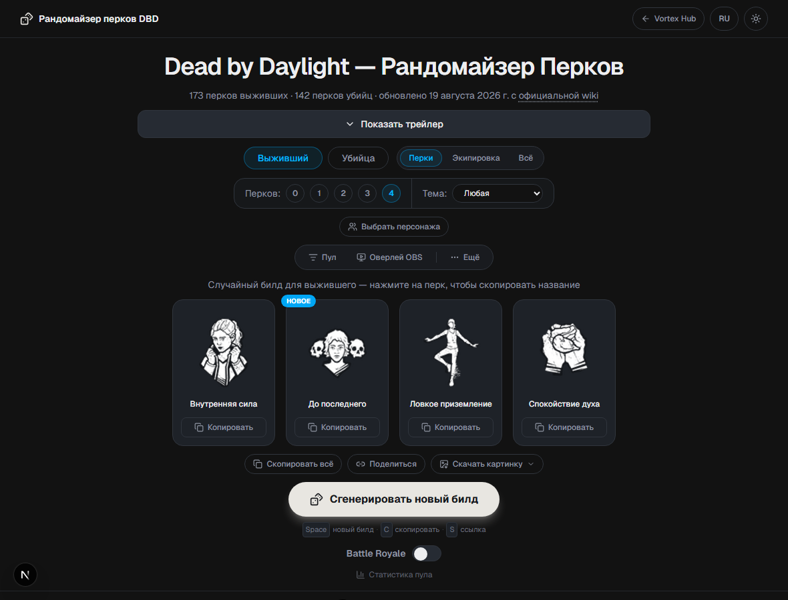
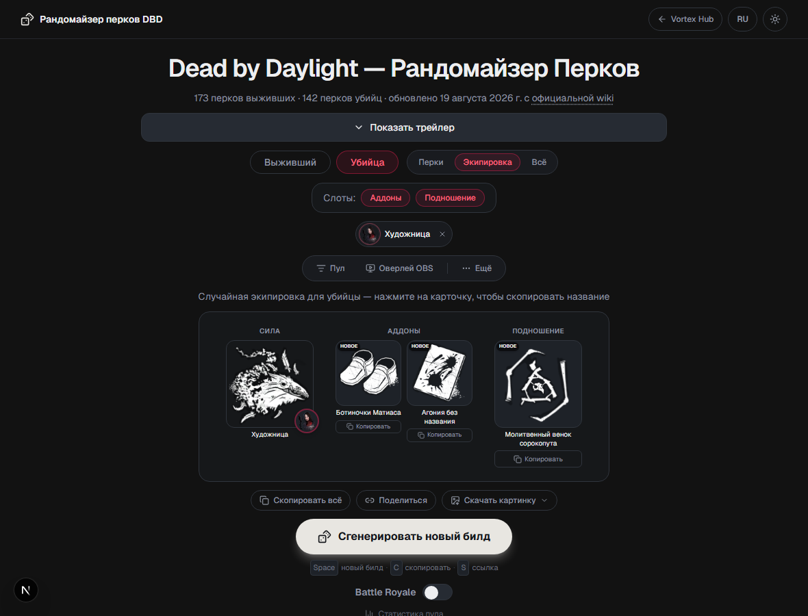
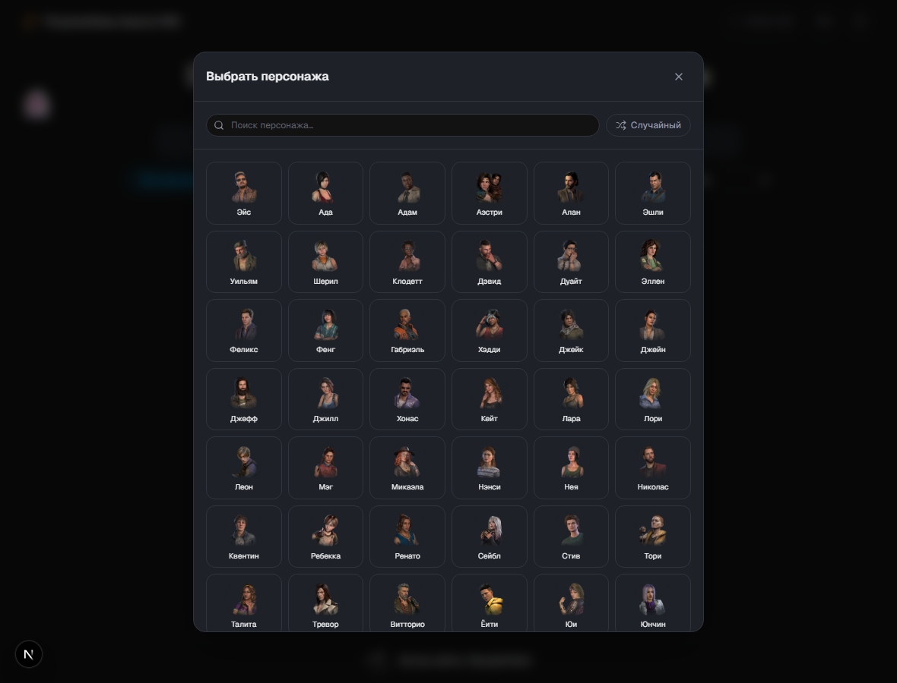
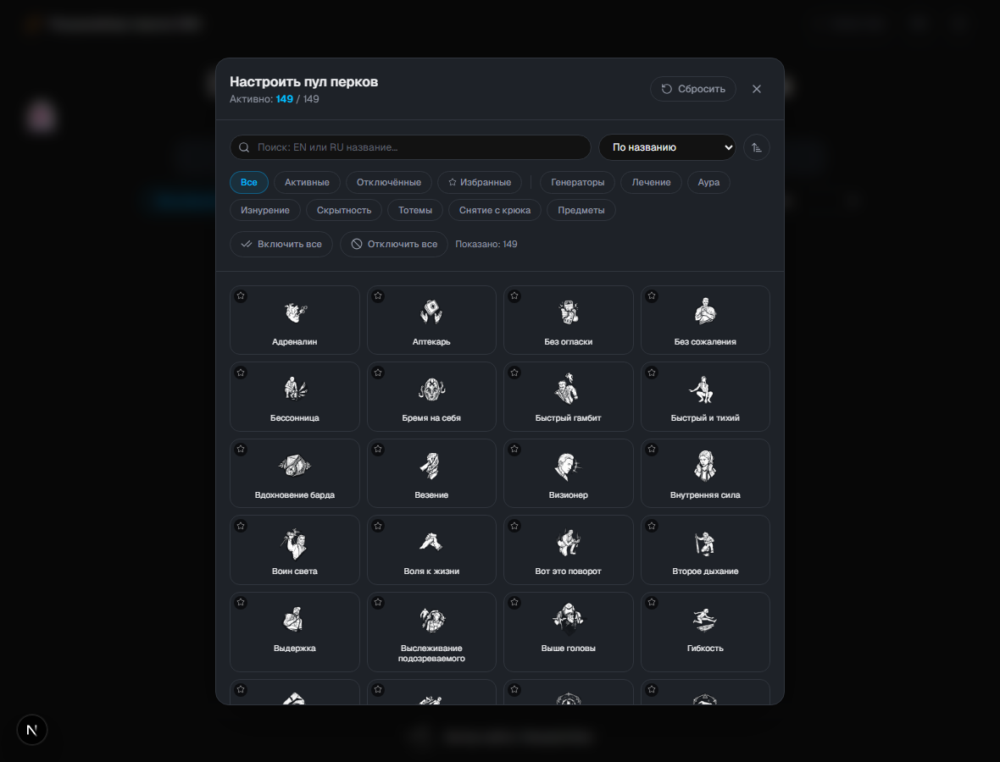
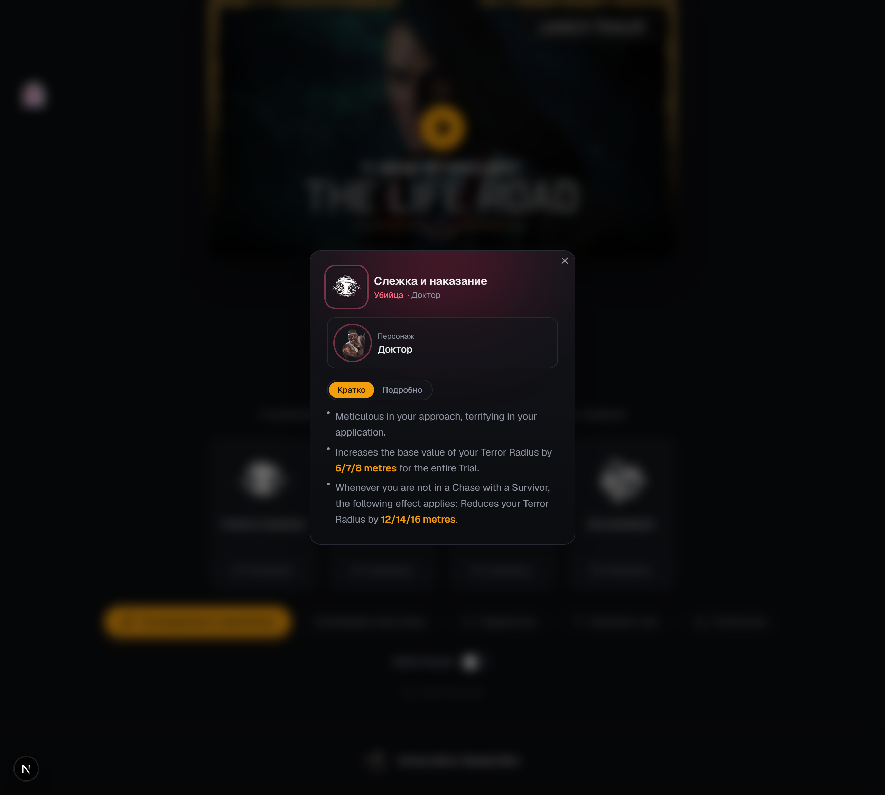
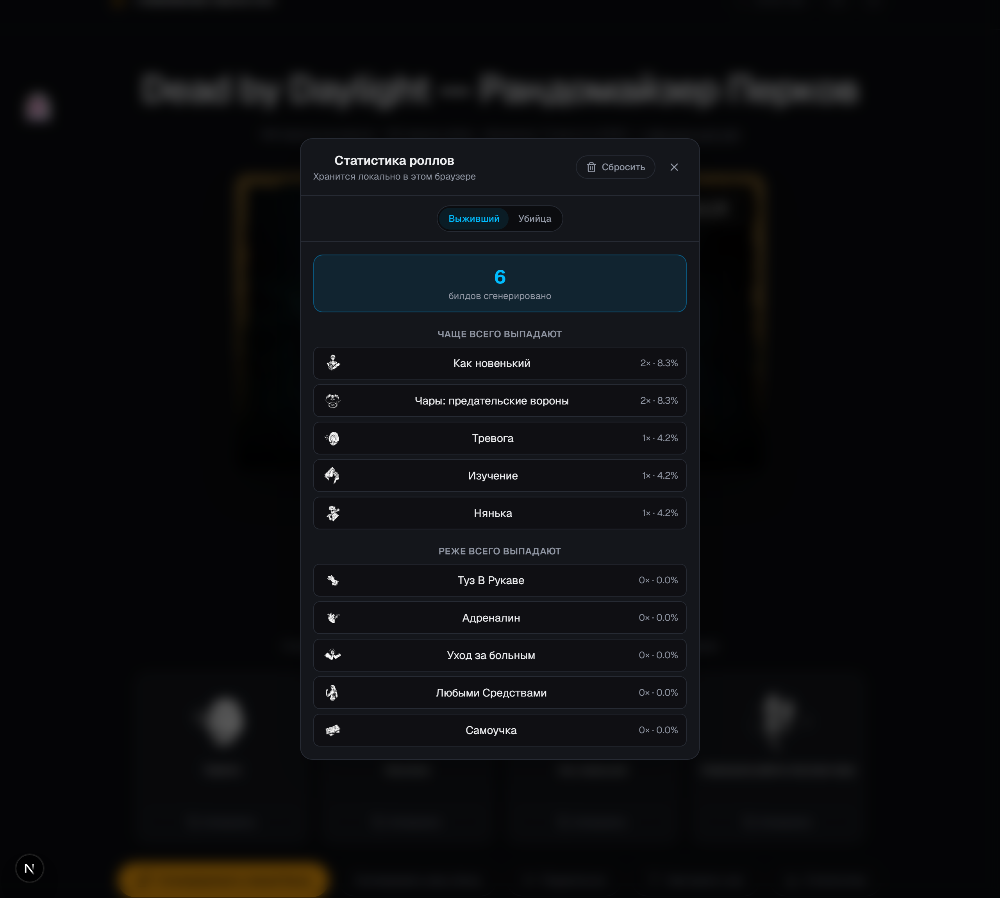
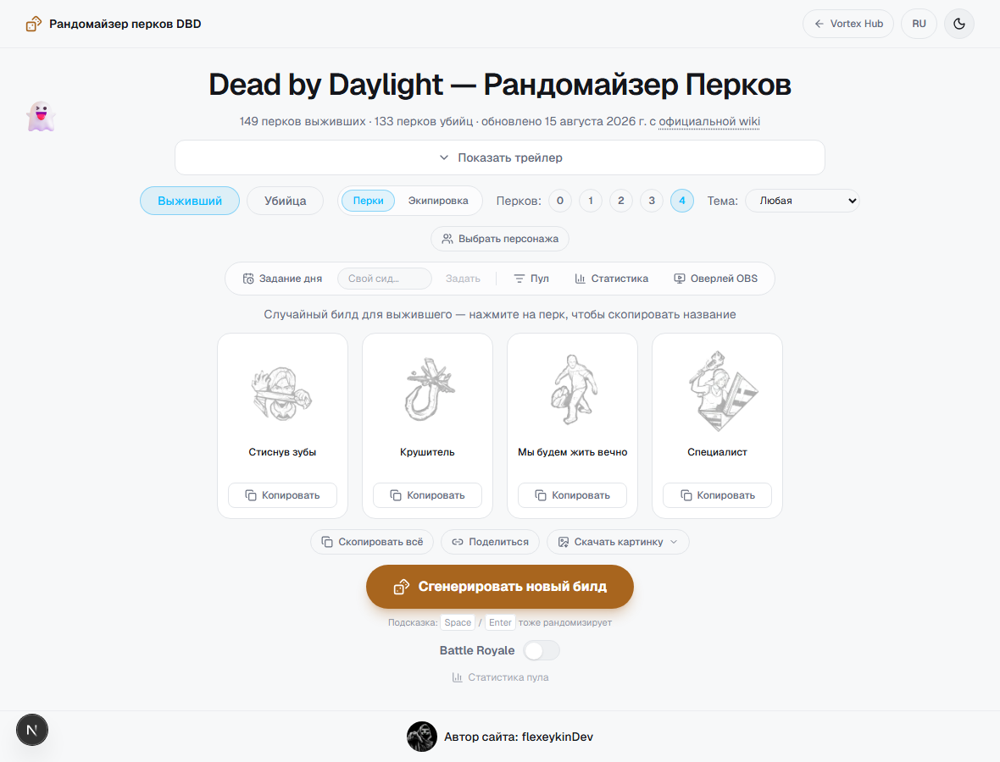

# DBD Perk Randomizer

[](https://github.com/flexeykinDev/dbd-perk-randomizer/actions/workflows/ci.yml)
[](https://github.com/flexeykinDev/dbd-perk-randomizer/actions/workflows/deploy.yml)
[](https://github.com/flexeykinDev/dbd-perk-randomizer/actions/workflows/update-perks.yml)
[](LICENSE)
[](https://nextjs.org)
[](https://www.typescriptlang.org)

**🇬🇧 [Read in English](README.md) · 🇷🇺 Читаете русскую версию**

Рандомайзер перков и экипировки **Dead by Daylight**, который никогда не
устаревает — весь список перков, предметов, аддонов и подношений
подтягивается напрямую с официальной wiki. Раньше жил как раздел [Vortex
Hub](https://github.com/flexeykinDev/Vortex-Hub), теперь отдельный проект.

**🔗 Живой сайт:** https://flexeykindev.github.io/dbd-perk-randomizer/

## Содержание

- [Скриншоты](#скриншоты)
- [Возможности](#возможности)
- [Battle Royale](#battle-royale)
- [Полная экипировка (Full Loadout)](#полная-экипировка-full-loadout)
- [Локализация экипировки](#локализация-экипировки-предметы-аддоны-подношения)
- [Случайный персонаж](#случайный-персонаж)
- [Оверлей для OBS](#оверлей-для-obs)
- [Перки — без хардкода](#перки--без-хардкода)
- [Разработка](#разработка)
- [Firebase](#firebase-для-синка-оверлея-obs-между-разными-профилями-браузера)
- [Контрибьютинг](#контрибьютинг)
- [Деплой](#деплой)
- [Стек](#стек)
- [Лицензия](#лицензия)

## Скриншоты

<!-- prettier-ignore -->
| | |
|---|---|
| **Билд выжившего** | **Экипировка убийцы + портрет** |
|  |  |
| **Выбор персонажа** | **Настройка пула перков** |
|  |  |
| **Карточка перка** | **Статистика роллов** |
|  |  |
| **Светлая тема** | |
|  | |

## Возможности

- 🎲 Случайный билд из 0–4 перков выжившего/убийцы + отдельный режим
  **Полной экипировки** (предмет/Сила, аддоны, подношение)
- 🧑 Выбор конкретного персонажа — гарантирует его тичеблы (режим перков)
  или решает, чья Сила роллится (режим экипировки для убийцы)
- 🌍 Переключение языка EN/RU, все названия и описания подтягиваются с
  официальных wiki, а не переводятся руками
- 🔍 Гибкое управление пулом: поиск, теги, сортировка, избранное,
  массовое включение/отключение
- 🔗 Шэринг билда по компактной ссылке, детерминированный Daily
  Challenge и свой сид
- 🖼️ Экспорт билда картинкой (обычный формат и вертикальная «история»)
- 📺 Оверлей для OBS с live-синком через `BroadcastChannel` +
  Firebase, настраиваемый прямо через query-параметры ссылки
- 💬 Управление ролью из чата Twitch (`!reroll`, `!paste`) с гибкими
  правами доступа
- ⚔️ Режим **Battle Royale** — выбывание билдов из пула до последнего
- 📊 Локальная статистика роллов и **История** последних 20 билдов
  (перков и экипировки) с возможностью открыть любой из них заново
- 📲 PWA — устанавливается, работает офлайн

Если исключить перков больше, чем нужно для билда, сайт честно скажет,
что перков не хватает, а не молча подмешает исключённые обратно.

## Battle Royale

Отдельный режим: скопированный (или сгенерированный заново — неважно как)
билд навсегда выбывает из пула на эту сессию, пока не закончатся все перки
роли. Прогресс живёт в localStorage и переживает перезагрузку страницы;
кнопка «Начать заново» сбрасывает его.

## Полная экипировка (Full Loadout)

Переключатель **Экипировка** рядом с **Перки** — второй режим роллов,
рядом с перками: предмет + 2 аддона + подношение для выжившего, 2 аддона
(на роллнутого убийцу) + подношение для убийцы (у убийц в DBD нет
предмета — вместо него в интерфейсе показывается иконка их Силы, с
портретом убийцы небольшим бейджем поверх). Каждый слот
(Предмет/Аддоны/Подношение) включается и отключается независимо.
Карточки выложены как в самом инвентаре игры — колонками
«Предмет/Сила → Аддоны → Подношение», а не общей сеткой, как у перков.

Режим полностью совместим с сидами (Задание дня и свой сид дают
одинаковую экипировку всем, кто открыл ту же ссылку), Battle Royale
(выбывание общее для перков и экипировки — один и тот же пул прогресса)
и оверлеем OBS (роллнутая экипировка тоже уходит в оверлей, теми же
карточками). Карточка предмета/аддона/подношения показывает описание с
тем же переключателем «Кратко/Подробно», что и у перков (см.
[Локализация экипировки](#локализация-экипировки-предметы-аддоны-подношения)
ниже).

Данные (`data/items.json`, `data/addons.json`, `data/offerings.json`,
`data/killer-power-icons.json`) тоже генерируются скрапером и
обновляются тем же еженедельным Action, что и перки:

```bash
npm run scrape:loadout
```

`scripts/scrape-loadout.ts` забирает страницы
[Items](https://deadbydaylight.fandom.com/wiki/Items),
[Add-ons](https://deadbydaylight.fandom.com/wiki/Add-ons) и
[Offerings](https://deadbydaylight.fandom.com/wiki/Offerings) через
MediaWiki API, определяет убийцу для каждой группы аддонов силы через
редиректы самой вики, и заходит на страницу каждого убийцы за иконкой
его Силы.

Предметы из категории «только карта/событие» (Eye of Vecna, Lament
Configuration, Keycard и т.д. — на вики помечены «Limited Item») в пул
не попадают: они появляются в трайле по сценарию конкретной главы,
игрок их не выбирает сам, так что предлагать их как выбор экипировки
было бы нечестно.

Когда собственная страница у конкретного предмета/аддона временно не в
порядке или иконка не загружена, `scripts/scrape-loadout.ts` точечно
подставляет исправление из другого источника (например,
[deadbydaylight.wiki.gg](https://deadbydaylight.wiki.gg)) — вместо
битой картинки или служебного текста ошибки.

## Локализация экипировки (предметы, аддоны, подношения)

Так же, как и у перков, русские названия и описания подтягиваются с
[русской вики](https://dead-by-daylight.fandom.com/ru/) — три скрипта
вместо одного, потому что вики раскладывает предметы/подношения/аддоны
по-разному:

```bash
npm run sync:loadout-localization   # RU-названия предметов и подношений
npm run sync:loadout-descriptions   # RU-описания предметов и подношений
npm run sync:loadout-addons         # RU-названия и описания аддонов (все 795)
npm run scrape:loadout              # подмешивает всё в data/*.json
```

- **Предметы и подношения** — у каждого своя страница, как у перков:
  `sync-loadout-localization.ts` ищет русское название через
  `action=opensearch`, проверяет по категории («Категория:Предметы» /
  «Категория:Подношения…»), затем `sync-loadout-descriptions.ts` берёт
  описание с той же страницы (пробуя оба варианта разметки —
  «Особенности» и «Использование», раз у предметов и подношений она
  разная).
- **Аддоны** отдельной страницы не имеют — вики группирует их по
  ~50 страницам (предмет/сила убийцы), например «Медвежий капкан
  (улучшения)» — все аддоны Ловца сразу. `sync-loadout-addons.ts`
  читает все эти страницы и сопоставляет каждую строку с нужным
  аддоном по английскому названию рядом с русским («Кровавая
  пружина(англ. Bloody Coil)»), а не по порядку строк.

Сопоставление аддонов сейчас покрывает ~91% — у самых новых убийц,
чья групповая страница ещё не появилась, оно показывает английский
текст с честной пометкой в карточке вместо ошибки.

## Случайный персонаж

Кнопка **Выбрать персонажа** (рядом с фильтром темы/слотами экипировки)
открывает модалку с поиском и сеткой портретов всех персонажей своей
роли — можно выбрать конкретного, нажать **Случайный** прямо в модалке
или сбросить выбор.

- **В режиме Перки:** тумблер **Гарантировать тичеблы**, который
  появляется рядом с портретом, гарантированно включает в билд
  собственные перки выбранного персонажа (пока не исключены из пула) —
  остальные слоты добираются как обычно случайно.
- **В режиме Экипировки, для убийцы:** сам выбор персонажа — это и есть
  результат: он решает, чьи аддоны Силы будут роллиться, вместо
  внутреннего случайного выбора. Портрет и Сила в HUD всегда совпадают
  (портрет — небольшим бейджем поверх иконки Силы). Панель управления
  пулом при выбранном убийце тоже сужается до его собственных аддонов,
  а не показывает все ~750 аддонов сразу. Для выжившего предметы/аддоны
  не привязаны к конкретному персонажу (как и в самой игре), так что там
  это чисто визуальный выбор.

## Оверлей для OBS

Кнопка **Оверлей OBS** открывает модалку с прозрачной ссылкой вида
`.../#/obs` — добавь её как источник **Browser** в OBS, и она будет в
реальном времени показывать те же карточки (перков или экипировки — в
зависимости от текущего режима основной вкладки), что сейчас на
основном сайте (синхронизация через `BroadcastChannel` + localStorage
локально и через Firebase Realtime Database между разными профилями
браузера — см. `lib/obs-sync.ts` и раздел [Firebase](#firebase-для-синка-оверлея-obs-между-разными-профилями-браузера)
ниже). Модалка показывает живое превью прямо поверх настроек — можно
перетащить каждую иконку куда нужно на канвасе (позиции сохраняются в самом
URL) — и настраивается прямо через query-параметры ссылки, чтобы всё было
закодировано в самом URL:

| Параметр | Значения | По умолчанию | Что делает |
|---|---|---|---|
| `scale` | `50`–`200` | `135` | Размер карточек, % (крутится слайдером в модалке) |
| `nameScale` | `100`–`300` | `170` | Дополнительная ширина под название карточки, % |
| `names` | `1` / `0` | `1` | Показывать название карточки под иконкой |
| `bg` | `transparent` / `dark` | `transparent` | Фон — прозрачный (для OBS) или тёмная подложка (для превью вне OBS) |
| `pos` | `x1,y1,x2,y2,…` (% от канваса) | — (стандартный ряд по центру) | Позиции иконок, задаются перетаскиванием в превью |

Модалка сама собирает ссылку по выбранным настройкам — крутить URL руками
не нужно. Три готовых пресета оформления (Компакт/Стандарт/Просторно)
задают холст, размер и ширину имени одним кликом; вкладка «Свой» даёт
точный контроль над каждым параметром. Ссылки, сохранённые ещё до
появления слайдера (со старым параметром `size=sm/md/lg`), тоже
продолжают работать — просто пересчитываются в эквивалентный `scale`.

Хочешь показывать в OBS сразу и перки, и экипировку? Проще всего — два
отдельных источника **Browser**: одна вкладка основного сайта в режиме
Перки, другая — в режиме Экипировки, у каждой свой `room`-код оверлея
(модалка создаёт его автоматически при первом открытии).

Там же — настройка реролла и вставки билда из чата Twitch (кто может
писать команды: все / только саб+VIP / только модераторы, своя команда,
свой кулдаун вместо фиксированных 4 секунд), плюс встроенный конструктор
билда для ручной подготовки команды `!paste` заранее.

## Перки — без хардкода

Перки живут в `data/perks.json` — файле, который генерирует скрапер, а
не ручной список, так что перки нового патча появляются без правок
кода:

```bash
npm run scrape:perks
```

Скрипт (`scripts/scrape-perks.ts`) забирает актуальный список перков, их
описания и портреты персонажей с [официальной wiki Dead by
Daylight](https://deadbydaylight.fandom.com/wiki/Perks) через MediaWiki
API, скачивает иконки/портреты в `public/perks/` и `public/characters/`,
и подмешивает русские названия/описания из `data/translations.ru.json`
и `data/description-translations.ru.json`. Иконки кэшируются по
фактическому URL-источнику на вики (`data/icon-sources.json`), так что
редизайн иконки подхватится на следующем прогоне, а не останется
незамеченным навсегда.

### Автообновление при выходе новых перков (DLC/патч)

Ничего руками трогать не нужно — раз в неделю (по понедельникам, 06:00 UTC)
GitHub Action **Update DBD perk and loadout data** сам прогоняет оба
скрапера (перки и экипировку) и, если на wiki что-то изменилось,
открывает один PR с диффом иконок/названий/описаний для ревью.

Если новый перк вышел прямо сейчас и ждать понедельника не хочется —
запусти тот же workflow вручную:

1. Вкладка **Actions** репозитория → workflow **Update DBD perk and loadout data**.
2. Кнопка **Run workflow** (это `workflow_dispatch`, срабатывает по клику,
   без ожидания расписания).
3. Через 1–2 минуты появится PR `auto/update-perks` — глянь в диффе, что
   иконки/названия подтянулись правильно, и смёржи.
4. Мёрж в `main` сам запускает **Deploy to GitHub Pages** — сайт
   обновится за 2–3 минуты, руками пушить/деплоить не нужно.

Если у нового перка нет ручного русского перевода в
`data/translations.ru.json` / `data/description-translations.ru.json`, он
всё равно появится на сайте — просто с английским описанием и
авто-сгенерированным (не переведённым вручную) кратким пересказом, пока
перевод не добавят отдельным PR.

### Обновление русских названий перков

Названия в `data/translations.ru.json` можно набирать руками, а можно
подтянуть официальные с [русской вики Dead by
Daylight](https://dead-by-daylight.fandom.com/ru/) (это отдельная вики, не
языковая версия английской — у них даже домен разный):

```bash
npm run sync:localization   # обновляет data/translations.ru.json
npm run scrape:perks        # подмешивает их в data/perks.json
```

`scripts/sync-localization.ts` ищет каждый перк по английскому названию
через `action=opensearch`, затем проверяет результат по официальным
категориям (`Категория:Умения Выживших` / `Категория:Умения Убийц`)
прежде чем доверять совпадению. Перк, не прошедший проверку, сохраняет
прежний перевод вместо отката на английский.

### Обновление русских имён персонажей и описаний перков

Тем же способом (поиск по вики + проверка совпадения, а не слепое
доверие первому результату) синхронизируются ещё два файла:

```bash
npm run sync:characters     # обновляет data/character-translations.ru.json
npm run sync:descriptions   # обновляет data/description-ru-raw.json
npm run scrape:perks        # подмешивает всё в data/perks.json
```

- `scripts/sync-characters.ts` — русские имена персонажей. У Выживших
  имя обрезается до первого слова статьи («Имя Фамилия»); у Убийц
  берётся заголовок целиком. Служебные страницы (главы DLC,
  хаб-страницы «Выжившие»/«Убийца») отфильтровываются отдельно — они в
  той же категории, что и настоящие персонажи, но ими не являются.
- `scripts/sync-descriptions.ts` — сырое русское описание с
  собственной страницы перка. Часть описаний оформлена шаблоном с
  плейсхолдером (`{процентов}`, `{метров}`, …) и таблицей значений по
  уровням — скрипт подставляет посчитанное значение (`20/28/36
  метров`). Перк, чья страница не укладывается в шаблон, просто
  пропускается и показывает английское описание вместо неверного
  перевода.

Оба скрипта, как и `sync-localization.ts`, никогда не затирают
существующий перевод результатом, в котором не уверены.

## Разработка

```bash
npm install
npm run dev       # http://localhost:3000
npm run lint
npm run build      # статический экспорт в out/
npm run test:e2e   # Playwright smoke tests
```

### Firebase (для синка оверлея OBS между разными профилями браузера)

OBS Studio рендерит Browser Source в собственном изолированном
Chromium-профиле — ни куки, ни localStorage, ни `BroadcastChannel` не
шарятся с обычным браузером стримера. Поэтому у оверлея (`#/obs`) есть
второй транспорт поверх локального: Firebase Realtime Database, на
который основная вкладка публикует текущий билд по случайному
8-символьному коду комнаты (`?room=XXXXXXXX`), а оверлей это читает —
см. `lib/obs-sync.ts` и `lib/firebase.ts`.

**Для обычной локальной разработки ничего настраивать не нужно** —
`lib/firebase.ts` уже содержит рабочий конфиг живого проекта, и любая
ошибка инициализации (нет сети, заблокировано расширением и т.п.)
просто откатывается к локальному транспорту, который и так работает
через вторую вкладку в том же браузере.

Если форкаешь репозиторий и хочешь, чтобы кросс-профильный синк работал
на своём деплое (а не писал в чужую базу):

1. [console.firebase.google.com](https://console.firebase.google.com) →
   **Add project** → **Build → Realtime Database → Create Database**
   (любой регион, можно начать в test mode).
2. **Project settings → Your apps →** `</>` (Web) → зарегистрировать
   приложение, скопировать объект `firebaseConfig`.
3. Вставить его в `lib/firebase.ts` вместо текущего.
4. **Realtime Database → Rules**, вставить и опубликовать:
   ```json
   {
     "rules": {
       ".read": false,
       ".write": false,
       "obs-rooms": {
         "$room": {
           ".read": "$room.length == 8",
           ".write": "$room.length == 8 && newData.hasChildren(['role', 'perks', 'language', 'updatedAt'])"
         }
       }
     }
   }
   ```
   Firebase-конфиг веб-приложения не секретный (доступ ограничивается
   именно этими правилами, не сокрытием ключа) — коммитить его в
   `lib/firebase.ts` нормально.

## Контрибьютинг

PR'ы и issues приветствуются.

- Перед PR: `npm run lint`, `npm run build` (включает проверку типов) и
  `npm run test:e2e` должны проходить локально — тот же набор гоняет CI.
- `data/perks.json`, `data/meta.json`, `data/characters.json`,
  `data/perk-ids.json`, `data/icon-sources.json` — **генерируются**
  скрапером (`npm run scrape:perks`), руками их не редактируем — правки
  затрутся при следующем прогоне. То же касается `data/items.json`,
  `data/addons.json`, `data/offerings.json`, `data/loadout-meta.json`,
  `data/loadout-ids.json`, `data/killer-power-icons.json` и
  `data/loadout-icon-sources.json` (`npm run scrape:loadout`).
- `data/translations.ru.json`, `data/character-translations.ru.json`,
  `data/description-translations.ru.json` — источник истины для ручных
  переводов, править можно (и нужно) напрямую. `data/description-ru-raw.json`
  — тоже генерируется (`npm run sync:descriptions`), но как fallback
  более низкого приоритета, чем `description-translations.ru.json`.
- Обновлял UI — обнови и `docs/screenshots/*.png`:
  `npm run capture:screenshots` (нужен запущенный `npm run dev` на
  порту 3000) перегенерирует их все автоматически через Playwright.
- Один PR — одна тема: проще смотреть диф скриншотов/переводов, когда
  он не перемешан с несвязанным рефакторингом.

## Деплой

Сайт собирается как статический экспорт (`output: 'export'`) и
публикуется на GitHub Pages через `.github/workflows/deploy.yml`
автоматически при каждом пуше в `main` (в том числе после мёржа PR от
скрапера выше). Его тоже можно дёрнуть вручную через
**Actions → Deploy to GitHub Pages → Run workflow**, если нужно
передеплоить без нового коммита.

## Стек

Next.js · TypeScript · React · Tailwind CSS · Framer Motion ·
lucide-react · Firebase Realtime Database · cheerio + sharp (скрапер) ·
Playwright (e2e + скриншоты)

## Лицензия

[MIT](LICENSE) — код свободен для использования, изменения и
распространения. Названия, описания, иконки перков и портреты
персонажей — данные Dead by Daylight, © Behaviour Interactive; сайт
никак не аффилирован с Behaviour Interactive и существует как фанатский
инструмент.
